# Le Dictionary Learning <a href="https://github.com/MiKL5/"></a>

## Définition
Le **Dictionary Learning** (apprentissage de dictionnaire) est une méthode d'apprentissage de représentations qui vise à décomposer un ensemble de signaux en **combinaisons linéaires parcimonieuses** (*sparse*) d'éléments de base appelés **atomes**, regroupés dans un **dictionnaire** D appris directement à partir des données.

Formellement, étant donné une matrice de données **X** ∈ ℝⁿˣᵐ (m exemples de dimension n), on cherche simultanément :
- un dictionnaire **D** ∈ ℝⁿˣᵏ (k atomes, avec généralement k > n : dictionnaire *sur-complet*)
- une matrice de codes **A** ∈ ℝᵏˣᵐ *parcimonieuse*

tels que **X ≈ DA**, avec la contrainte que chaque colonne αᵢ de A soit sparse (‖αᵢ‖₀ ≤ s, où s ≪ k).

Le problème d'optimisation s'écrit :

```
min_{D,A}  ‖X − DA‖²_F    sous    ‖αᵢ‖₀ ≤ s  ∀i,  ‖dⱼ‖₂ = 1  ∀j
```

Ce problème est **bi-convexe** (convexe en D à A fixé, et vice-versa), mais NP-difficile dans le cas général. Il est résolu par alternance.

## Origines et chronologie
### Racines neuroscientifiques (1996)
Le fondement théorique du Dictionary Learning est issu des neurosciences computationnelles. **Olshausen & Field** (1996) ont montré que les propriétés des cellules simples du cortex visuel primaire (V1) émergent naturellement lorsqu'on impose une contrainte de **parcimonie** sur la représentation de patchs d'images naturelles. Leurs filtres appris ressemblent étonnamment aux champs récepteurs de Gabor observés biologiquement — une validation croisée entre le modèle computationnel et la neurobiologie.

> Olshausen, B.A. & Field, D.J. (1996). *Emergence of simple-cell receptive field properties by learning a sparse code for natural images*. **Nature**, 381, 607–609. https://doi.org/10.1038/381607a0

### Matching Pursuit et bases sur-complètes (1993)

En traitement du signal, **Mallat & Zhang** (1993) posent les bases algorithmiques du codage parcimonieux avec le **Matching Pursuit** : une méthode greedy de décomposition d'un signal sur un dictionnaire sur-complet par sélection itérative de l'atome le plus corrélé au résidu.

> Mallat, S.G. & Zhang, Z. (1993). *Matching pursuits with time-frequency dictionaries*. **IEEE Transactions on Signal Processing**, 41(12), 3397–3415. https://doi.org/10.1109/78.258082

### MOD — Method of Optimal Directions (1999)

**Engan, Aase & Husøy** (1999) proposent le premier algorithme pratique d'apprentissage de dictionnaire : le **MOD**. Il alterne entre une étape de codage parcimonieux (OMP) et une mise à jour du dictionnaire par pseudo-inverse. C'est la première formalisation explicite du problème bi-convexe.

> Engan, K., Aase, S.O. & Husøy, J.H. (1999). *Method of optimal directions for frame design*. In *Proceedings of ICASSP 1999*, IEEE, vol. 5, pp. 2443–2446. https://doi.org/10.1109/ICASSP.1999.760624

### K-SVD — l'algorithme de référence (2006)

**Aharon, Elad & Bruckstein** (2006) généralisent le MOD en proposant **K-SVD** (*K-Singular Value Decomposition*), qui met à jour les atomes du dictionnaire **un par un** via une décomposition en valeurs singulières tronquée. K-SVD est devenu l'algorithme canonique du domaine et est encore massivement cité aujourd'hui.

> Aharon, M., Elad, M. & Bruckstein, A. (2006). *K-SVD: An algorithm for designing overcomplete dictionaries for sparse representation*. **IEEE Transactions on Signal Processing**, 54(11), 4311–4322. https://doi.org/10.1109/TSP.2006.881199

### Online Dictionary Learning (2009–2010)

**Mairal, Bach, Ponce & Sapiro** (2009/2010) résolvent le problème de passage à l'échelle en proposant un apprentissage **en ligne** (stochastique), adaptant le dictionnaire mini-batch par mini-batch. C'est aujourd'hui l'implémentation de référence dans scikit-learn.

> Mairal, J., Bach, F., Ponce, J. & Sapiro, G. (2010). *Online learning for matrix factorization and sparse coding*. **Journal of Machine Learning Research**, 11, 19–60. https://jmlr.org/papers/v11/mairal10a.html

### Ouvrage de synthèse

> Elad, M. (2010). *Sparse and Redundant Representations: From Theory to Applications in Signal and Image Processing*. **Springer**. ISBN 978-1-4419-7010-7.

---

## Pourquoi le Dictionary Learning ?

Les bases orthogonales classiques (Fourier, ondelettes) sont **universelles mais sous-optimales** : elles ne s'adaptent pas aux structures locales des données. Le Dictionary Learning est motivé par trois arguments fondamentaux :

1. **Adaptativité** : le dictionnaire est appris *depuis* les données, non prescrit. Les atomes capturent les structures récurrentes propres au domaine (textures, patterns fréquentiels, morphèmes, etc.).
2. **Sur-complétude** : en autorisant k > n, on dispose d'une redondance contrôlée qui offre une robustesse au bruit et une flexibilité de représentation.
3. **Interprétabilité** : contrairement aux représentations apprises par réseaux de neurones profonds, les atomes d'un dictionnaire sont directement inspectables dans l'espace des données originales (pixels, spectres, etc.).

---

## Algorithmes principaux

### Étape 1 — Sparse Coding (à D fixé)

Pour chaque signal xᵢ, on résout :

```
min_{αᵢ}  ‖xᵢ − Dαᵢ‖²₂    sous    ‖αᵢ‖₀ ≤ s
```

Algorithmes courants :
* **OMP** (Orthogonal Matching Pursuit) — greedy, efficace pour s petit
* **LASSO** — relaxation convexe ℓ₁ de la contrainte ℓ₀
* **LARS** — parcours du chemin de régularisation LASSO

### Étape 2 — Mise à jour du dictionnaire (à A fixé)

* **MOD** : D ← XA⁺ (pseudo-inverse), puis normalisation des colonnes
* **K-SVD** : pour chaque atome dⱼ, SVD tronquée du résidu **Eⱼ = X − Σ_{l≠j} dₗαₗᵀ** → prend l'élément de rang 1

### Convergence

La convergence vers un minimum local est garantie pour MOD et K-SVD sous des conditions de départ raisonnables. La convexité globale n'est pas garantie ; les solutions dépendent de l'initialisation (souvent par patches aléatoires des données d'entraînement).

---

## Cas d'utilisation

Domaine | Application | Référence notable
---|---|---
Vision par ordinateur | Débruitage d'images (état de l'art vers 2006–2012) | Elad & Aharon (2006), *IEEE TIP*
Vision par ordinateur | Super-résolution, complétion d'images | Yang et al. (2010), *IEEE CVPR*
Imagerie médicale | IRM compressée (compressed sensing) | Lustig et al. (2007), *MRM*
Traitement audio | Séparation de sources, débruitage | Févotte & Idier (2011) |
NLP (pré-DL) | Représentations de documents (analogie avec topic modeling) | Mairal et al. (2009)
Détection d'anomalies | Reconstruction sparse : erreur élevée = anomalie | Wright et al. (2009), *PAMI*
Bioinformatique | Analyse de données d'expression génique | —

---

## Boîte blanche, grise ou noire ?

Le Dictionary Learning est clairement du côté de la **boîte blanche** (ou, dans les cas les plus complexes, de la **boîte grise claire**).

**Arguments pour la boîte blanche :**
* Les atomes dⱼ sont des vecteurs dans l'espace des données originales : pour des images, ce sont des *patchs visuellement interprétables*. On peut les afficher, les analyser, les comparer.
* Le mécanisme de reconstruction est **linéaire et explicite** : x ≈ Σ αⱼdⱼ. On sait exactement quels atomes contribuent et dans quelle proportion.
* La contrainte de parcimonie est une *prior* explicitement formulée, non émergente.
* Le problème d'optimisation est mathématiquement tracé, les gradients sont connus.

**Nuance boîte grise :**
* Le dictionnaire appris peut contenir des atomes difficiles à interpréter sémantiquement lorsque les données sont complexes ou de haute dimension.
* L'initialisation influence la solution finale (minimum local), ce qui introduit une part d'opacité sur *quel* dictionnaire a été appris parmi les solutions possibles.

En synthèse : le Dictionary Learning est l'**un des rares modèles d'apprentissage de représentation qui reste pleinement auditable**, ce qui lui confère un avantage décisif dans les domaines où l'interprétabilité est réglementairement ou scientifiquement requise (médical, signal de défense, forensique).

---

## Limites et positionnement contemporain

Avec l'avènement du Deep Learning (2012–), le Dictionary Learning a perdu sa position dominante en vision par ordinateur au profit des CNN, puis des Vision Transformers. Cependant :

* Il reste utilisé en **compressed sensing** et imagerie médicale (IRM, scanner).
* Il est la base théorique des **Sparse Autoencoders** (SAE), aujourd'hui centraux dans la recherche en **interprétabilité mécanistique** des LLM (Anthropic, DeepMind, 2023–2024).
* Il offre des **garanties théoriques** (conditions de récupération exacte via RIP, cohérence mutuelle) absentes dans les architectures profondes.

---

## Références complètes

1. [Olshausen, B.A. & Field, D.J. (1996). *Emergence of simple-cell receptive field properties by learning a sparse code for natural images*. **Nature**, 381, 607–609](https://doi.org/10.1038/381607a0).
2. [Mallat, S.G. & Zhang, Z. (1993). *Matching pursuits with time-frequency dictionaries*. **IEEE Transactions on Signal Processing**, 41(12), 3397–3415](https://doi.org/10.1109/78.258082).
3. [ Engan, K., Aase, S.O. & Husøy, J.H. (1999). *Method of optimal directions for frame design*. **ICASSP 1999**, IEEE, vol. 5, 2443–2446](https://doi.org/10.1109/ICASSP.1999.760624).
4. [Aharon, M., Elad, M. & Bruckstein, A. (2006). *K-SVD: An algorithm for designing overcomplete dictionaries for sparse representation*. **IEEE Transactions on Signal Processing**, 54(11), 4311–4322](https://doi.org/10.1109/TSP.2006.881199).
5. [Mairal, J., Bach, F., Ponce, J. & Sapiro, G. (2010). *Online learning for matrix factorization and sparse coding*. **Journal of Machine Learning Research**, 11, 19–60](https://jmlr.org/papers/v11/mairal10a.html).
6. Elad, M. (2010). *Sparse and Redundant Representations: From Theory to Applications in Signal and Image Processing*. Springer. ISBN 978-1-4419-7010-7.
7. [Wright, J., Yang, A.Y., Ganesh, A., Sastry, S.S. & Ma, Y. (2009). *Robust face recognition via sparse representation*. **IEEE Transactions on Pattern Analysis and Machine Intelligence**, 31(2), 210–227](https://doi.org/10.1109/TPAMI.2008.79).

___
[← Retour](../../../)